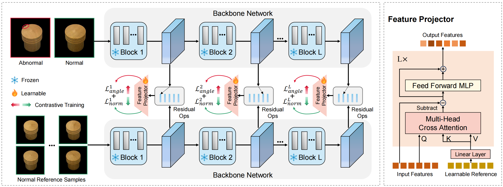

# [NeurIPS2025] [ADPretrain: Advancing Industrial Anomaly Detection via Anomaly Representation Pretraining](https://arxiv.org/abs/2511.05245)

## Poster
<p align="center">
  
</p>

## Abstract
The current mainstream and state-of-the-art anomaly detection (AD) methods are
substantially established on pretrained feature networks yielded by ImageNet pretraining. However, regardless of supervised or self-supervised pretraining, the pretraining process on ImageNet does not match the goal of anomaly detection (i.e., pretraining in natural images doesn’t aim to distinguish between normal and
abnormal). Moreover, natural images and industrial image data in AD scenarios typically have the distribution shift. The two issues can cause ImageNet-pretrained features to be suboptimal for AD tasks. To further promote the development of the AD field, pretrained representations specially for AD tasks are eager and very
valuable. To this end, we propose a novel AD representation learning framework specially designed for learning robust and discriminative pretrained representations for industrial anomaly detection. Specifically, closely surrounding the goal of anomaly detection (i.e., focus on discrepancies between normals and anomalies), we propose angle- and norm-oriented contrastive losses to maximize the angle size and norm difference between normal and abnormal features simultaneously. To avoid the distribution shift from natural images to AD images, our pretraining is performed on a large-scale AD dataset, RealIAD. To further alleviate the potential shift between pretraining data and downstream AD datasets, we learn the pretrained AD representations based on the class-generalizable representation, residual features. For evaluation, based on five embedding-based AD methods, we simply replace their original features with our pretrained representations. Extensive experiments on five AD datasets and five backbones consistently show the superiority of our pretrained features.

## Overview
<p align="center">
  
</p>

## Install Environments

You can refer to the `requirements.txt` to install required environments.

```
pip install -r requirements.txt
```
Experiments are conducted on NVIDIA GeForce RTX 4090 (24GB).

## Download Datasets
Please download MVTecAD dataset from [MVTecAD dataset](https://www.mvtec.com/de/unternehmen/forschung/datasets/mvtec-ad/), VisA dataset from [VisA dataset](https://amazon-visual-anomaly.s3.us-west-2.amazonaws.com/VisA_20220922.tar), BTAD dataset from [BTAD dataset](http://avires.dimi.uniud.it/papers/btad/btad.zip), and MVTec3D dataset from [MVTec3D dataset](https://www.mvtec.com/company/research/datasets/mvtec-3d-ad), MPDD dataset from [MPDD dataset](https://github.com/stepanje/MPDD). You can put these datasets in the `data` diretory.


You can also alter it according to your need, just remember to modify the corresponding `data_path` in the code. 

### Real-IAD
Contact the authors of Real-IAD [URL](https://realiad4ad.github.io/Real-IAD/) to get the download link.

Download and unzip `realiad_512` and `realiad_jsons` in `./data/Real-IAD`.
`./data/Real-IAD` will be like:
```
|-- Real-IAD
    |-- realiad_512
        |-- audiokack
        |-- bottle_cap
        |-- ....
    |-- realiad_jsons
        |-- realiad_jsons
        |-- realiad_jsons_sv
        |-- realiad_jsons_fuiad_0.0
        |-- ....
```

## Download Few-Shot Reference Samples
Then, you should download the few-shot reference normal samples. Please download the few-shot normal reference samples from [ref-data](https://huggingface.co/xcyao00/ADPretrain/blob/main/8shot.zip) and put the data in the `./data` directory.

## Experiments
### Checkpoints
We provide our pretrained weights. You can download them and please place them in the `checkpoints` folder.

<table border="1" align="center">
  <tr align="center">
    <th>Backbone</th>
    <th>Input Size</th>
    <th>Weights</th>
  </tr>
  <tr align="center">
    <td>DINOv2-base</td>
    <td>R224<sup>2</sup>-C224<sup>2</sup></td>
    <td><a href="https://huggingface.co/xcyao00/ADPretrain/tree/main/dino-base">model</a></td>
  </tr>
  <tr align="center">
    <td>DINOv2-large</td>
    <td>R224<sup>2</sup>-C224<sup>2</sup></td>
    <td><a href="https://huggingface.co/xcyao00/ADPretrain/tree/main/dino-large">model</a></td>
  </tr>
  <tr align="center">
    <td>CLIP-base</td>
    <td>R224<sup>2</sup>-C224<sup>2</sup></td>
    <td><a href="https://huggingface.co/xcyao00/ADPretrain/tree/main/clip-base">model</a></td>
  </tr>
  <tr align="center">
    <td>CLIP-large</td>
    <td>R224<sup>2</sup>-C224<sup>2</sup></td>
    <td><a href="https://huggingface.co/xcyao00/ADPretrain/tree/main/clip-large">model</a></td>
  </tr>
  <tr align="center">
    <td>ImageBind</td>
    <td>R224<sup>2</sup>-C224<sup>2</sup></td>
    <td><a href="https://huggingface.co/xcyao00/ADPretrain/tree/main/imagebind">model</a></td>
  </tr>
</table>

### Creating Reference Features
Please run the following code for extracting reference features for generating residual features.
<details>
<summary>
MVTecAD
</summary>

```bash
python extract_ref_features.py --backbone dinov2-large --dataset mvtec
```
</details>

<details>
<summary>
VisA
</summary>

```bash
python extract_ref_features.py --backbone dinov2-large --dataset visa
```
</details>

<details>
<summary>
BTAD
</summary>

```bash
python extract_ref_features.py --backbone dinov2-large --dataset btad
```
</details>

<details>
<summary>
MVTec3D
</summary>

```bash
python extract_ref_features.py --backbone dinov2-large --dataset mvtec3d
```
</details>

<details>
<summary>
MPDD
</summary>

```bash
python extract_ref_features.py --backbone dinov2-large --dataset mpdd
```
</details>

The backbone here and in the following can be `dinov2-base`, `dinov2-large`, `clip-base`, `clip-large` and `imagebind`.

### Creating Center Features
Please run the following code for obtaining center features used in the angle-oriented contrastive loss.

```bash
python get_center_features.py --backbone dinov2-large --data_path ./data/Real-IAD --save_path ./centers/dino_large_rfeature_centers.npy
```

### Pretrain on Real-IAD
Please run the following code for pretraining on the Real-IAD dataset.

```bash
python main.py --train_dataset_dir ./data/Real-IAD --test_dataset_dir ./data/mvtec_anomaly_detection --backbone dinov2-large --checkpoint_path ./checkpoints/dinov2-large --test_ref_feature_dir ./ref_features/dinov2-large/mvtec_8shot --feature_centers ./centers/dino_large_rfeature_centers.npy
```

### Test on Downstream AD Methods
<details>
<summary>
PaDiM
</summary>

```bash
python train_val_padim.py --backbone dinov2-large --with_pretrained --pretrained_weights ./checkpoints/dinov2-large/checkpoints_pro_angle.pth --dataset mvtec --dataset_dir ./data/mvtec_anomaly_detection --ref_feature_dir ./ref_features/dinov2-large/mvtec_8shot
```
</details>

<details>
<summary>
PatchCore
</summary>

```bash
python train_val_patchcore.py --backbone dinov2-large --with_pretrained --pretrained_weights ./checkpoints/dinov2-large/checkpoints_pro_angle.pth --dataset mvtec --dataset_dir ./data/mvtec_anomaly_detection --ref_feature_dir ./ref_features/dinov2-large/mvtec_8shot
```
</details>

<details>
<summary>
CFLOW
</summary>

```bash
python train_val_cflow.py --backbone dinov2-large --with_pretrained --pretrained_weights ./checkpoints/dinov2-large/checkpoints_pro_norm.pth --dataset mvtec --dataset_dir ./data/mvtec_anomaly_detection --ref_feature_dir ./ref_features/dinov2-large/mvtec_8shot
```
</details>

<details>
<summary>
GLASS
</summary>

For `GLASS`, you should download the foreground masks from [fg mask](https://drive.google.com/file/d/1Fn84QCfMtgBGEDcmY44v97Ci8wwpABK8/view?usp=sharing/) and put them in the `./ad_models/glass` directory. 
DTD is an auxiliary texture dataset used for data augmentation in GLASS. You should download from here [DTD](https://www.robots.ox.ac.uk/~vgg/data/dtd/) and put DTD dataset in `./data` directory.


```bash
python train_val_glass.py --backbone dinov2-large --with_pretrained --pretrained_weights ./checkpoints/dinov2-large/checkpoints_pro_norm.pth --dataset mvtec --dataset_dir ./data/mvtec_anomaly_detection --ref_feature_dir ./ref_features/dinov2-large/mvtec_8shot
```
</details>

<details>
<summary>
UniAD
</summary>

```bash
python train_val_uniad.py --backbone dinov2-large --with_pretrained --pretrained_weights ./checkpoints/dinov2-large/checkpoints_pro_norm.pth --dataset mvtec --dataset_dir ./data/mvtec_anomaly_detection --ref_feature_dir ./ref_features/dinov2-large/mvtec_8shot
```
</details>

<details>
<summary>
FeatureNorm
</summary>

```bash
python val_norm.py --backbone dinov2-large --with_pretrained --pretrained_weights ./checkpoints/dinov2-large/checkpoints_pro_norm.pth --dataset mvtec --dataset_dir ./data/mvtec_anomaly_detection --ref_feature_dir ./ref_features/dinov2-large/mvtec_8shot
```
</details>

## Citation
If our work is helpful for your research, please consider citing:
```
@InProceedings{yao2025ADPretrain,
    title={ADPretrain: Advancing Industrial Anomaly Detection via Anomaly Representation Pretraining},
    author={Xincheng Yao and Yan Luo and Zefeng Qian and Chongyang Zhang},
    year={2024},
    booktitle={Thirty-Ninth Annual Conference on Neural Information Processing Systems, NeurIPS 2025},
    url={https://arxiv.org/abs/2511.05245},
    primaryClass={cs.CV}
}
```
If you are interested in our work, you may can also see our previous works: [BGAD (CVPR2023)](https://github.com/xcyao00/BGAD), [PMAD (AAAI2023)](https://github.com/xcyao00/PMAD), [FOD (ICCV2023)](https://github.com/xcyao00/FOD), [HGAD (ECCV2024)](https://github.com/xcyao00/HGAD), [ResAD (NeurIPS2024)](https://github.com/xcyao00/ResAD).
